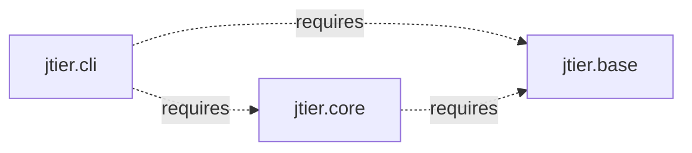

# Jigsaw

## Regular Jars


## Jigsaw Modules



## Compile
```
$ javac -d out --module-source-path src -d mods $(find src -name '*.java')

```

## Run CLI with main class (not packaged yet)

```
java -p mods -m jtier.cli/com.groupon.jtier.cli.Main
```
OR
```
java --module-path mods --module jtier.cli/com.groupon.jtier.cli.Main
```
